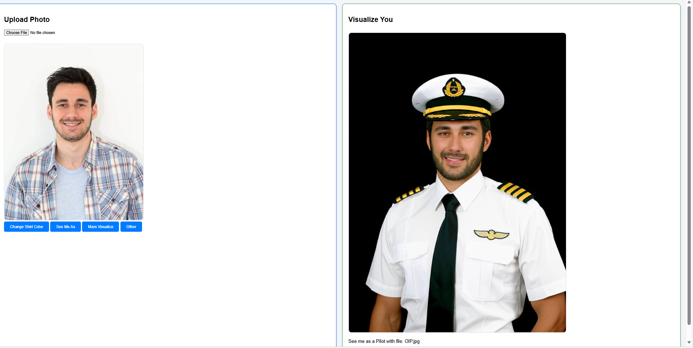

# AI-Powered User Image Visualization and Motivation (Visualize You) 
**Powered by Google Cloud Platform**

## 🚀 Overview  
This project is a web-based application that enables users to generate personalized, AI-powered images based on their uploaded photos and textual prompts. It combines generative AI with cloud infrastructure to help users **visualize their dreams, aspirations, or future selves**.

 - I had this idea before Google came up with it.

## 🏗️ Architecture Overview  
The solution is deployed on **Google Cloud Platform (GCP)** and consists of the following core components:

- **Client-Web Interface**  
  Built using **HTML/CSS** with a **Flask (Python)** backend, the web interface allows users to upload images and input prompts.

- **Compute Engine VM**  
  The application runs inside a **Docker container** hosted on a **Google Cloud VM instance**, ensuring scalable and isolated execution.

- **Cloud Storage**  
  All uploaded images are securely stored in a **GCP Cloud Storage bucket**, providing reliable and persistent storage.

- **Vertex AI Services**  
  Utilizes **Vertex AI’s generative models ( Gemini 2.0)** to create personalized images based on the uploaded photos and text prompts.

## 🌟 Key Features  
- End-to-end deployment using containerized infrastructure on GCP  
- AI-driven image generation using Vertex AI  
- Persistent, secure storage of user uploads via GCP Cloud Storage  
- User-friendly interface for seamless interaction and visualization

## 💡 Motivation  
This application is designed to **inspire and motivate** users by letting them visualize their future through AI-generated content. It showcases how modern cloud-native technologies and generative AI can be combined to deliver **scalable**, **secure**, and **high-quality personalized experiences**.

## 🛠️ Tech Stack  
- Python / Flask  
- HTML / CSS  
- Google Cloud Platform (GCP)  
  - Compute Engine  
  - Cloud Storage
  - Vertex AI
- Docker  
- Vertex AI Gemini 2.0 (for generative image creation)
